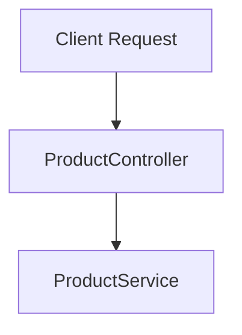

# 🛒 ProductController – REST API Endpoint Guide

The `ProductController` is responsible for handling HTTP requests related to product operations in a Spring Boot RESTful application. It acts as the entry point for clients (frontend, Postman, etc.) to interact with the product service.

This controller exposes endpoints to:

- Create a product
- Fetch all products
- Fetch a single product by ID
- Delete a product
- Demonstrate custom request mapping

---

## 🔧 Controller Annotations Explained

### `@RestController`
- Combines `@Controller` and `@ResponseBody`
- Automatically serializes returned objects (typically to JSON)
- Ideal for RESTful services

### `@RequestMapping("/products")`
- Maps the controller to a base URL
- All endpoints in this controller will start with `/products`

---

## 📮 API Endpoints Overview

### 1. Create a Product

- **HTTP Method:** `POST`  
- **Endpoint:** `/products`
- **Annotation:** `@PostMapping("/products")`

#### 📝 Description:
This endpoint accepts a request body (usually JSON) containing product details. When the request is made, Spring detects the URL and method type, and this function gets invoked.

```java
@PostMapping("/products")
public Product createProduct(@RequestBody ProductRequestDTO dto) {
    return productService.createProduct(dto);
}
````

---

### 2. Get All Products

* **HTTP Method:** `GET`
* **Endpoint:** `/products`
* **Annotation:** `@GetMapping("/products")`

#### 📝 Description:

Handles GET requests to fetch all products. Ideal for listing products on UI or dashboard.

```java
@GetMapping("/products")
public List<Product> getAllProducts() {
    return productService.getAllProducts();
}
```

---

### 3. Get Product by ID

* **HTTP Method:** `GET`
* **Endpoint:** `/products/{id}`
* **Annotations:** `@GetMapping`, `@PathVariable`

#### 📝 Description:

Used to fetch a specific product using its unique ID provided in the URL.

```java
@GetMapping("/products/{id}")
public Product getProduct(@PathVariable Long id) {
    return productService.getProductById(id);
}
```

#### 🔍 Why use `@PathVariable`?

* Extracts dynamic values from the URL path
* Example: `/products/5` → `id = 5`

---

### 4. Delete Product by ID

* **HTTP Method:** `DELETE`
* **Endpoint:** `/products/{id}`
* **Annotations:** `@DeleteMapping`, `@PathVariable`

#### 📝 Description:

Handles deletion of a product identified by the provided ID.

```java
@DeleteMapping("/products/{id}")
public void deleteProduct(@PathVariable Long id) {
    productService.deleteProduct(id);
}
```

---

### 5. Custom Request Mapping (Demo Purpose)

* **Annotation:** `@RequestMapping`
* **Custom Method Example:**

```java
@RequestMapping(name = "Tony", value = "/products/")
public String magic() {
    return "Hello Tony";
}
```

> ⚠️ Note: Custom HTTP methods like `"TONY"` aren't standard and won't work out-of-the-box with tools like Postman unless explicitly configured. This is for demonstration only.

---

## 🔄 Controller Execution Flow Diagram



---

## 🧠 Handling Multiple Service Implementations

If multiple `ProductService` classes exist, Spring needs to know which one to inject.

### Option 1: Use `@Primary`

Marks the preferred service implementation.

```java
@Primary
@Service
public class DbProductService implements ProductService {
    // Implementation
}
```

### Option 2: Use `@Qualifier`

Manually specify which implementation to inject:

```java
@Autowired
public ProductController(@Qualifier("dbProductService") ProductService service) {
    this.productService = service;
}
```

> 🔁 You can also create a global config to dynamically choose which service to use at runtime.

---

## 🧾 Summary Table

| Operation         | HTTP Method | URL              | Annotation(s)                     |
| ----------------- | ----------- | ---------------- | --------------------------------- |
| Create Product    | POST        | `/products`      | `@PostMapping`                    |
| Get All Products  | GET         | `/products`      | `@GetMapping`                     |
| Get Product by ID | GET         | `/products/{id}` | `@GetMapping`, `@PathVariable`    |
| Delete Product    | DELETE      | `/products/{id}` | `@DeleteMapping`, `@PathVariable` |
| Custom Mapping    | TONY (demo) | `/products/`     | `@RequestMapping`                 |

---


